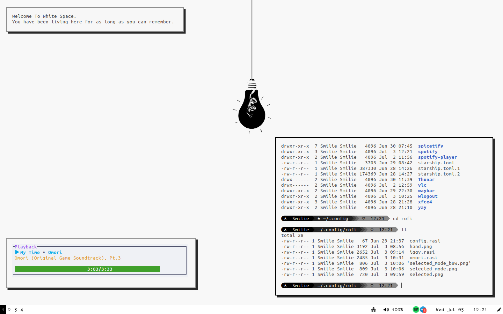

# Config Files
This is my configuration files. Use it if you want.

## Tools in this configuration
* Terminal UI Git: lazygit
* Terminal: powershell, bash
* Custom Prompts: starship

For my Arch Setup, check [the arch folder](./arch).

