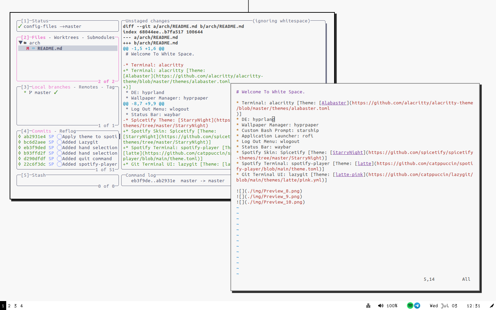
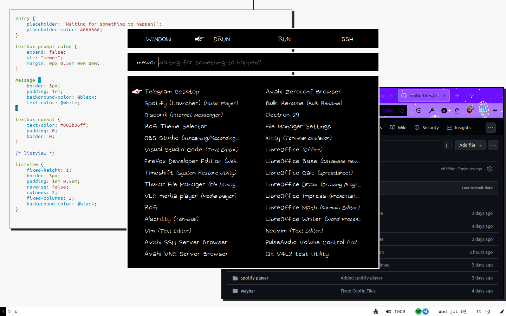
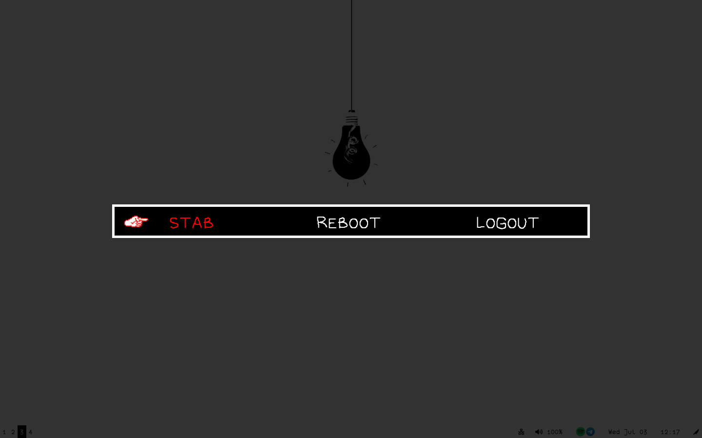

# Welcome To White Space.

* Terminal: alacritty [Theme: [Alabaster](https://github.com/alacritty/alacritty-theme/blob/master/themes/alabaster.toml
)]
* DE: hyprland
* Wallpaper Manager: hyprpaper
* Custom Bash Prompt: starship
* Application Launcher: rofi
* Log Out Menu: wlogout
* Status Bar: waybar
* Spotify Skin: Spicetify [Theme: [StarryNight](https://github.com/spicetify/spicetify-themes/tree/master/StarryNight)]
* Spotify Terminal: spotify-player [Theme: [latte](https://github.com/catppuccin/spotify-player/blob/main/theme.toml)]
* Git Terminal UI: lazygit [Theme: [latte-pink](https://github.com/catppuccin/lazygit/blob/main/themes/latte/pink.yml)]

